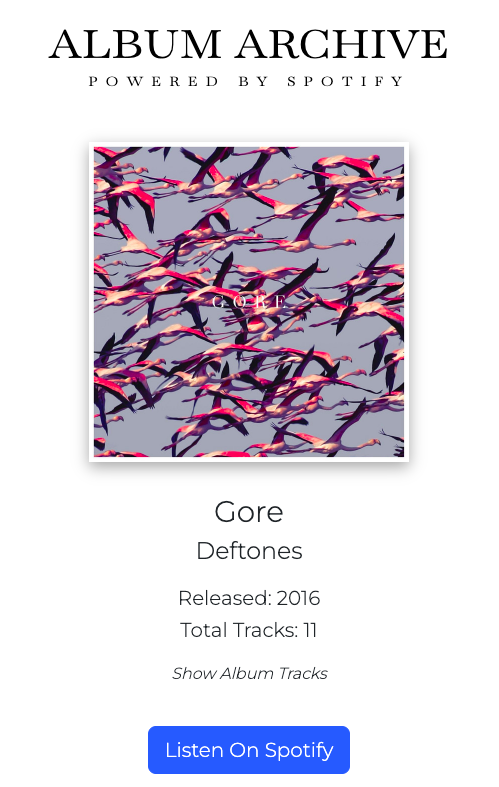

# ALBUM ARCHIVES

This project was created to practice new technologies which are commonly used in react. In this app you can search for musicans and bands to see all their albums and information for each album. All data, including the cover images, is provided by Spotify APIs and every album that is displayed has a link to the album on Spotify. All rights of the fetched metadata belongs to Spotify or to the displayed artist or label.

[Visit the App!](https://ruben-leon.github.io/spa-final-project_ruben-leon/)

## Technologies and Tools:

-   React
-   Vite
-   React Router
-   React-Bootstrap

## Data:

-   [Spotify for Developers](https://developer.spotify.com/)

## Screenshots of the App:

